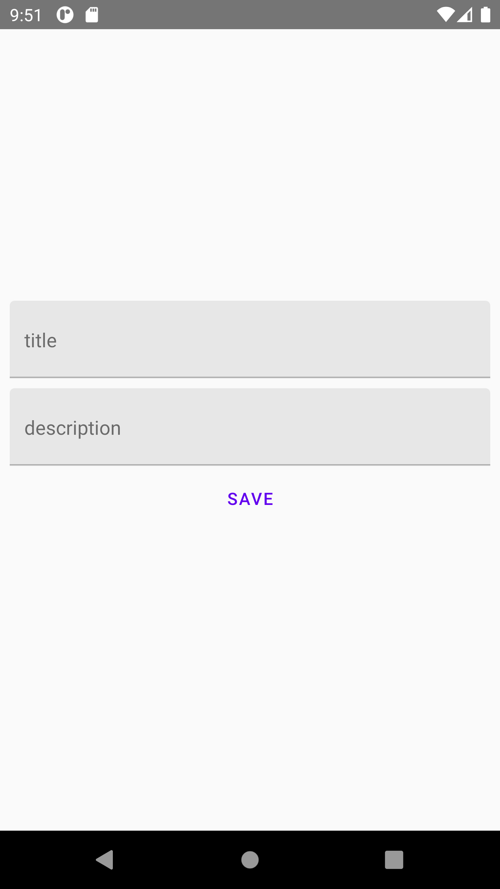

# RNN Native Stack Navigator
- Beim Klicken des FAB öffnet sich nun ein neues Fenster zum Hinzufügen eines Todos.
- Beim Speichern wird das Todo an den Todo Screen zurückgegeben, welcher das Todo hinzufügt.

